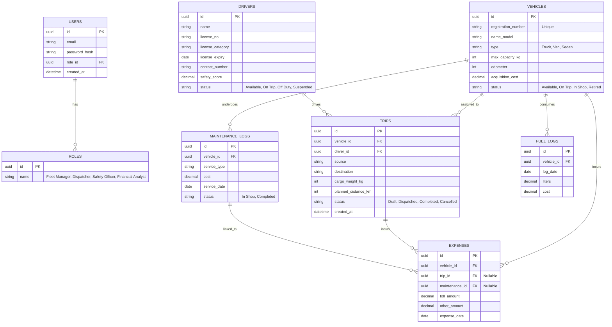

# TransitOps Entity-Relationship Diagram (ERD)

This document maps out the core entities and their relationships for the TransitOps platform, based on the Sprint 0 requirements and UI wireframes.

```mermaid
erDiagram
    USERS ||--o{ ROLES : has
    USERS {
        uuid id PK
        string email
        string password_hash
        uuid role_id FK
        datetime created_at
    }
    
    ROLES {
        uuid id PK
        string name "Fleet Manager, Dispatcher, Safety Officer, Financial Analyst"
    }

    VEHICLES ||--o{ TRIPS : assigned_to
    VEHICLES ||--o{ MAINTENANCE_LOGS : undergoes
    VEHICLES ||--o{ FUEL_LOGS : consumes
    VEHICLES ||--o{ EXPENSES : incurs
    VEHICLES {
        uuid id PK
        string registration_number "Unique"
        string name_model
        string type "Truck, Van, Sedan"
        int max_capacity_kg
        int odometer
        decimal acquisition_cost
        string status "Available, On Trip, In Shop, Retired"
    }

    DRIVERS ||--o{ TRIPS : drives
    DRIVERS {
        uuid id PK
        string name
        string license_no
        string license_category
        date license_expiry
        string contact_number
        decimal safety_score
        string status "Available, On Trip, Off Duty, Suspended"
    }

    TRIPS ||--o{ EXPENSES : incurs
    TRIPS {
        uuid id PK
        uuid vehicle_id FK
        uuid driver_id FK
        string source
        string destination
        int cargo_weight_kg
        int planned_distance_km
        string status "Draft, Dispatched, Completed, Cancelled"
        datetime created_at
    }

    MAINTENANCE_LOGS ||--o{ EXPENSES : linked_to
    MAINTENANCE_LOGS {
        uuid id PK
        uuid vehicle_id FK
        string service_type
        decimal cost
        date service_date
        string status "In Shop, Completed"
    }

    FUEL_LOGS {
        uuid id PK
        uuid vehicle_id FK
        date log_date
        decimal liters
        decimal cost
    }

    EXPENSES {
        uuid id PK
        uuid vehicle_id FK
        uuid trip_id FK "Nullable"
        uuid maintenance_id FK "Nullable"
        decimal toll_amount
        decimal other_amount
        date expense_date
    }
```
